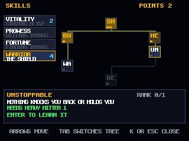
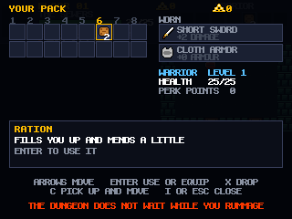

# Pixel Dungeon — real-time, up to four heroes

A roguelike in the shape of *Pixel Dungeon*, played in real time and in co-op.
Twenty-five procedurally generated floors in five themed chapters, a boss on
every fifth, fog of war, and everything you would expect to find on the way
down: locked vaults, unidentified potions, hidden traps, and a hunger clock.

Everything in it was made here — every sprite is hand-authored pixel data, the
font is a hand-drawn 8x8 bitmap, the music is original chip loops, and the
WebSocket server is written from scratch. **There are no dependencies.** You
need Node 18+ and nothing else.


The same tileset, re-baked in each chapter's palette:


## Play

**In a browser: <https://benjaminmwaldo.github.io/pixel-dungeon/>**

Pick a hero, then **HOST A PARTY** and share the four-letter code, or **JOIN
WITH A CODE**. **DELVE ALONE** needs no network at all — the whole dungeon runs
in your own tab.

### How multiplayer works without a server

One player's browser runs the authoritative simulation and the others connect
straight to it over a WebRTC data channel. A public PeerJS broker does nothing
but the introduction; once you are connected, the traffic goes browser to
browser. That is why the whole game can live on a static host.

The free broker uses STUN and no TURN relay, so a strict corporate, school or
symmetric-NAT network may refuse to make the connection. Home wifi and phone
hotspots are the target.

### On one network, with no broker at all

The same simulation also runs under Node, which is nicer on a LAN because
nothing leaves the building:

```bash
node server/index.js
```

Open <http://localhost:8080/?lan=1> — the server prints a second address for
everyone else on the wifi. The `?lan=1` is what tells the client to use the
server instead of a peer. Change the port with `--port 9000`.

## Controls

| | |
|---|---|
| Arrows / WASD | move |
| Z | attack |
| X | class ability (bolt, arrow, brace, cloak) |
| E or Space | use the stairs, a well, a pedestal |
| 1-8 | use the item in that quick slot |
| I | open your pack |
| K | open your skill trees |
| C | pick up and move an item; change class in the lobby |
| Enter | confirm, ready up |
| M | mute |

Neither the pack nor the skill trees pause anything — three other people are
still playing. You stand still while they are open, and the floor notices.

A gamepad works if one is plugged in, and touch controls appear on phones.

## The dungeon

**Five chapters, five floors each.** The sewers, the prison, the caves, the
metropolis and the demon halls. Each has its own palette, its own creatures,
and a boss on its last floor that seals the way down until it falls.

Floors are generated by splitting the 32x32 map into rooms, connecting them
with doors on shared walls, and turning the leftover rooms into the corridors
that tie everything together. Dead ends become libraries, gardens, wells,
statuaries, treasuries — and sometimes a vault behind a locked door whose iron
key is hidden elsewhere on the floor.

**You only see what you can see.** Field of view is recursive shadowcasting at
eight tiles; step into a room and the whole room lights up. Ground you have
walked is remembered but drawn dim, and what you have never seen is black.
Monsters are not sent to your client at all unless they are in your sight — the
fog is enforced by the server, not painted over the top.

**Four classes, one party.** The warrior takes a beating and hits hardest in
reach. The mage throws arcane bolts and dies if you look at them. The rogue is
quick, slips into shadow, and reads traps through the floor. The ranger's arrows
carry, and they see a tile further than anyone.

**Skill trees.** Every level hands you a perk point. Three trees are open to
everyone — VITALITY for staying alive, PROWESS for hitting things, FORTUNE for
finding them — and a fourth belongs to your class alone. Nodes unlock the nodes
below them, most have two or three ranks, and everything folds into one stat
block the simulation reads, so a perk changes how the game plays rather than
just a number on a screen: LOCKPICK opens locked doors without a key, PIERCING
BOLT sends the mage's bolts through what they kill, HUNTER'S EYE lets the ranger
feel monsters through walls, and PACK RAT simply gives you more room.



**A pack you can actually rummage in.** Sixteen slots (more with PACK RAT or
DEEP POCKETS), the first eight reachable with the number keys. Gear you find
waits in the pack instead of auto-equipping, so you choose what to wear and
what to leave; equipping swaps the old piece back into your bag. You can move
things between slots, and drop anything on the floor — which is how you hand a
potion to the mage who needs it.



**Loot is unidentified.** Every run shuffles which colour of glass and which
rune goes with which effect, so the first crimson potion is a gamble — and once
anyone in the party learns it, everyone knows.

**Co-op.** Each hero has their own camera and can be on their own floor; the
status bar shows where everyone is and how they are doing, and the party shares
what it has explored. Keys, gold and knowledge are shared; hearts are your own.
A hero at zero hit points becomes a spirit that a friend can bring back by
standing with them. If everyone falls, the run is over.

## How it fits together

```
shared/     everything that decides an outcome — game.js (the authority),
            session.js (the message pump), terrain, level generation, field of
            view, physics, player motion, the bestiary, loot and perk trees
client/     render.js, screens.js, net.js, peer.js, input.js, audio.js, main.js
client/art/ every sprite, tile and glyph, authored as text
server/     ws.js (RFC 6455 from scratch) and index.js — the optional LAN host
```

`Session` is handed a `send(playerId, obj)` and a `broadcast(obj)` and has no
idea whether those go down a WebSocket or a data channel. The Node server and
the browser host drive the same class, so there is one implementation of the
game and two ways to reach it.

The server simulates at a fixed 30 Hz and is the only thing that decides
anything. Clients send an input frame every tick and the server queues them, so
a swing held for a single tick can never be dropped. Each client predicts its
own hero by running `shared/player.js` — the identical code the server runs —
and replays its unacknowledged frames on top of every snapshot. Everyone else
is interpolated 70 ms in the past. A floor's map is sent once on arrival
(1 KB), after which only tile changes travel; a snapshot is a couple of hundred
bytes.

Sprites are authored as text, one character per pixel, and compiled to canvases
once at boot. The whole tileset is drawn once and re-baked in each chapter's
palette, plus a dimmed copy for remembered ground:

```js
export const RAT1 = `
..00........00..
.0dd0......0dd0.
.011110..011110.
..011111111110..
..01d11111d110..
`;
```

## Checks

```bash
node scripts/validate-art.js     # every sprite rectangular, right size, real colours
node scripts/levelgen-test.js 40 # 1000 floors: stairs reachable, nothing stranded
node scripts/smoke.js            # gameplay against the real simulation
node scripts/net-test.js 8080    # two live clients (server must be running)
node scripts/show-floor.js 13 3  # print any floor as ASCII
node scripts/build-pages.js      # assemble the static site into dist/
```

Every push to `main` runs the art, level and gameplay checks and, if they pass,
publishes `dist/` to GitHub Pages. There is no bundler and no build config to
get wrong — every path in the page is relative, so the same files work at the
root or under `/pixel-dungeon/`.

`scripts/gen-bosses.js` builds the five 32x32 bosses from shape primitives, so
their rows cannot drift out of alignment; edit that script rather than the
generated `client/art/bosses.js`.

Running with `--dev` adds a `POST /__shot` endpoint that writes a canvas
capture to `docs/shot.png`. It exists so the art can be reviewed from a script;
it is off by default.
