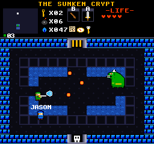
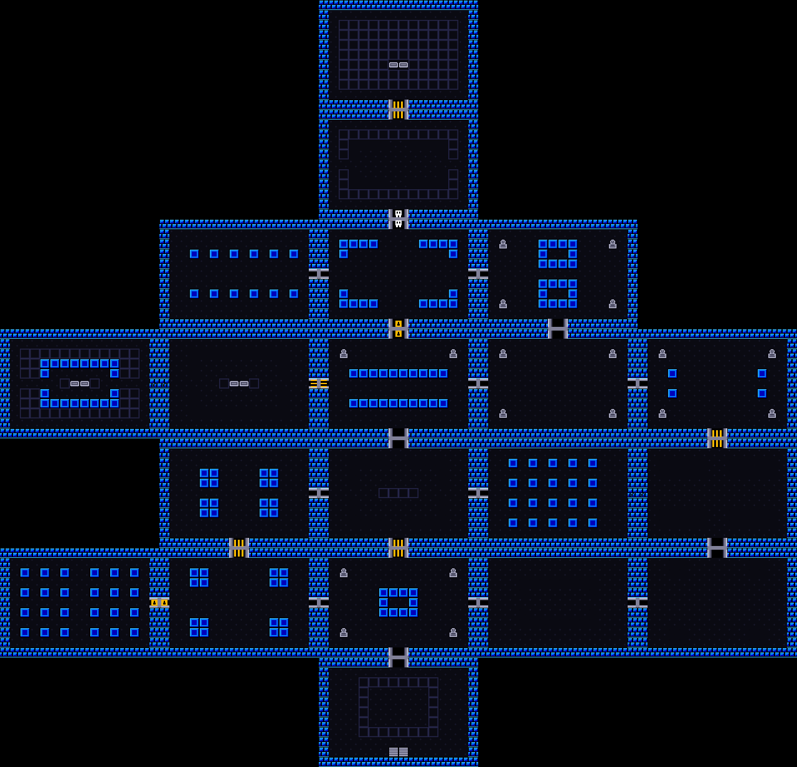

# The Sunken Crypt

A real-time, four-player pixel dungeon crawler in the shape of the original
*Legend of Zelda*: one screen per room, 16×16 tiles, a sword you stab rather
than swing, shutters that slam until the room is clear, and a boss at the end
of a locked corridor.

Everything in it was made here — every sprite is hand-authored pixel data, the
font is a hand-drawn 8×8 bitmap, the music is an original chip loop, and the
WebSocket server is written from scratch. **There are no dependencies.** You
need Node 18+ and nothing else.



Every room of the dungeon, rendered by the game itself:



## Play

```bash
node server/index.js
```

Then open <http://localhost:8080>. The server prints a second address on your
local network — anyone on the same wifi opens that, picks **JOIN WITH A CODE**,
and types the four letters the host is shown.

To play with someone who is not on your network, put a tunnel in front of it
(`cloudflared tunnel --url http://localhost:8080`, ngrok, or Tailscale) and
share the tunnel URL. A static host like GitHub Pages will not work — the game
needs the authoritative server process.

Use a different port with `node server/index.js --port 9000`.

## Controls

| | |
|---|---|
| Arrows / WASD | move |
| Z / J / Space | sword |
| X / K | use the B item (bombs, boomerang, potion) |
| C / Shift | swap the B item |
| Enter | confirm, ready up |
| M | mute |

A gamepad works if one is plugged in, and touch controls appear on phones.

## The dungeon

Twenty hand-built rooms. The way forward is barred three times: two small-key
doors, and a skull door that needs the Skull Key from the Wisp Sanctum. One
wall is cracked and only a bomb opens it; one room hides a staircase behind a
block that can be pushed. The relic sits past the Drowned Wyrm.

**What you can find:** the Map, the Compass, a Bag of Bombs, the Boomerang, two
Heart Containers, the Skull Key, and the Sunken Relic.

**What lives there:** fleet bats, splitting slimes, bonewalkers, blade-throwing
hurlers, armoured ironclads that shrug off anything hitting their shield,
teleporting wisp mages, grabhands that drag you back to the entrance, and the
Drowned Wyrm.

**Co-op rules.** Keys, bombs, gems and treasures belong to the whole party;
hearts are yours alone. Each hero has their own camera, so you can split up and
work two ends of the dungeon at once — the minimap shows where everyone is.
When a hero falls they become a spirit; stand on them for two seconds to bring
them back, or wait thirty and they return to the entrance themselves. If
everyone falls, the crypt pulls the party back to the entrance with the doors
you opened still open. Your own bombs never hurt you.

At full hearts the sword throws a beam, exactly as you would hope.

## How it fits together

```
shared/     code both sides run — constants, the dungeon, physics, player motion
server/     ws.js (RFC 6455 from scratch), game.js (the authority), index.js
client/     render.js, net.js, input.js, audio.js, main.js
client/art/ every sprite, tile and glyph, authored as text
```

The server simulates at a fixed 30 Hz and is the only thing that decides
anything. Clients send an input frame every tick, and the server **queues**
those frames rather than sampling the newest, so a sword swing held for a
single tick can never be dropped. Each client predicts its own hero by running
`shared/player.js` — the identical code the server runs — and replays its
unacknowledged input frames on top of every snapshot; corrections are folded
into a decaying offset so they never visibly snap. Everyone else is
interpolated 70 ms in the past. A two-player snapshot is about 220 bytes.

Sprites are authored as text, one character per pixel, and compiled to canvases
once at boot:

```js
export const SLIME1 = `
.....000000.....
....07777770....
...0797997970...
..077777777770..
`;
```

The hero's tunic uses palette slots 7/8/9 so the same drawing is re-baked in
four colours, one per player.

## Checks

```bash
node scripts/validate-art.js   # every sprite rectangular, right size, real colours
node scripts/smoke.js          # 16 gameplay checks against the real simulation
node scripts/net-test.js 8080  # two live clients: party, cameras, roster (server must be running)
```

`scripts/fix-wyrm.js` regenerates the 32×32 boss from 8-pixel column groups, so
its rows cannot drift out of alignment.

Running with `--dev` adds a `POST /__shot` endpoint that writes a canvas
capture to `docs/shot.png`. It exists so the art can be reviewed from a script;
it is off by default.
